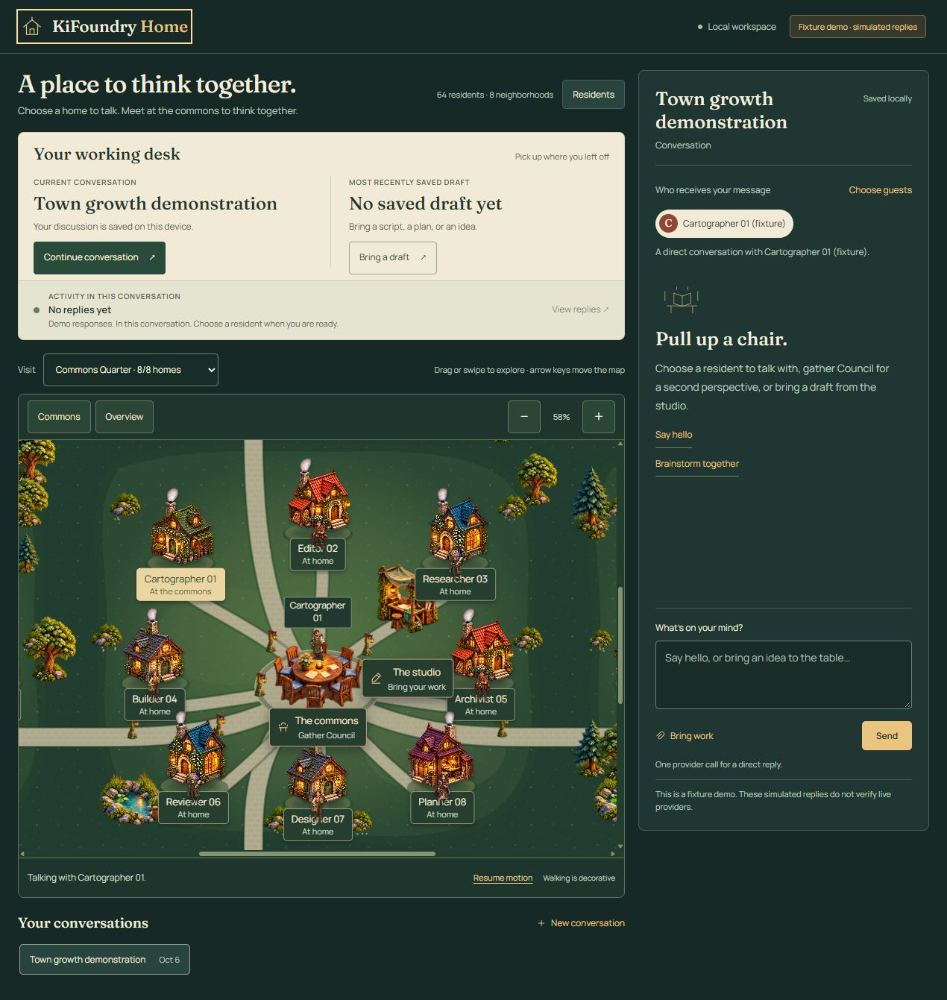

# KiFoundry Home

An RPG town for conversations with AI agents. Visit a resident, bring a draft, ask a group to challenge it, and keep the discussion and revisions for later.

**Local development alpha · Python 3.11+ · Windows native-provider verification**



## Try it

Download **Code → Download ZIP**, extract it, and open a terminal in the extracted folder containing this README. Or clone the repository with Git.

```sh
python -m home.cli --demo --data-dir .demo-data --open
```

This opens a browser with clearly labelled, scripted residents. It needs no account and makes no AI calls. Keep the terminal open; press **Ctrl+C** to stop. The ZIP contains source code, not a desktop installer.

For Python installation, a virtual environment, or troubleshooting, follow the [getting started guide](docs/QUICKSTART.md).

## What you can do

| You want to… | Start here |
| --- | --- |
| Talk to one resident | Choose their house or **Residents → Talk** |
| Explore a growing town | Pan or zoom the map; use **Visit** or **Overview** to reach another neighborhood |
| Discuss an idea together | Choose guests, then **Ask the Council** |
| Improve a script or draft | **Bring work**, save it, then send your request |
| Keep a useful reply | **Use as draft**, review it, then save a revision |
| Continue later | Restart with the same data directory; **Your working desk** shows the current conversation, saved draft and reply status |

Council uses independent proposals, one round of challenges, and an attributed synthesis. It preserves replies and disagreements. A group of `N` residents can use up to `2N+1` provider calls; the interface shows the bound before Send.

The town supports up to 64 active residents in connected neighborhoods. New residents fill free plots; moving someone out keeps their history and the other homes in place. Restore prefers their former plot when it is still free.

## Use real AI

Install and sign in to Claude Code and/or Codex separately, then configure a local connection. Follow [provider setup](docs/PROVIDERS.md). Native replies use your provider account. The app creates its own sessions; it does not attach to an existing desktop chat.

Conversations and saved drafts live on your computer. Prompts and selected context go to the configured provider when you send a native message. See [privacy and data](docs/PRIVACY.md).

## Learn more

- [User guide](docs/USING.md) — conversations, Council, revisions and recovery.
- [Documentation index](docs/README.md) — setup, troubleshooting and developer reference.
- [Known limitations](docs/KNOWN-LIMITATIONS.md) · [next improvements](docs/ROADMAP.md).
- [Contributing](CONTRIBUTING.md) · [architecture](docs/ARCHITECTURE.md) · [contracts](docs/CONTRACTS.md).
- [MIT license](LICENSE) · [asset provenance](ASSETS.md) · [verification](docs/VERIFICATION.md).
